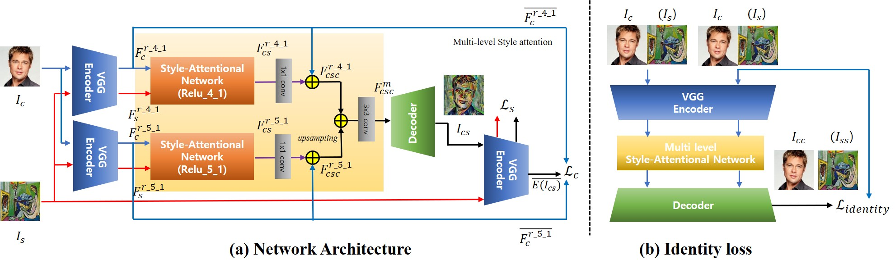
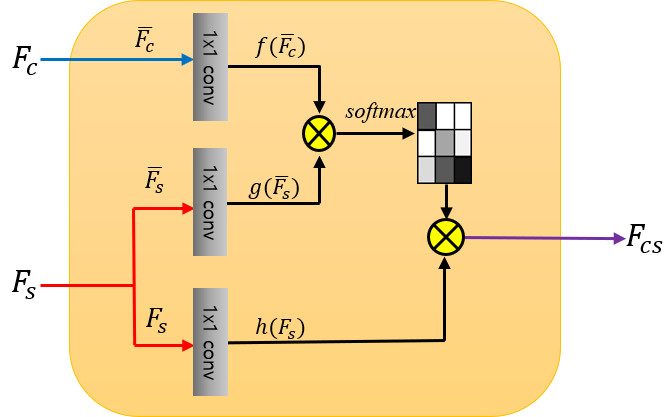

*

### 论文内容：
```python

使用self-attention的SANET实现风格迁移

基本概念：

​	内容图像lc,   风格图像ls   并根据lc的语义，ls的特征合成lcs

​	在这项工作中，vgg19作为编码器和对称解码器

网络架构：

​	两个SANET:为了充分结合全局样式和部分样式，我们通过将来自不同层编码(relu4.1和relu5.1)的vgg特征图作为输入，并组合两个输出特征图		来集成两个saNET.

	单个SANET中的操作：

​		使用vgg在特定层提取各自的vgg特征图。Fc=E(Ic) 和 Fs=E(Is)

​		在对lc和ls图像进行编码后，我们将两个特征图放置到一个SANET中，从而生成Fcs

​		Fcs = SANet(Fc,Fs)..............(1)

​		进行一次1*1卷积后，得到Fcsc

​		Fcsc=Fc+WcsFcs.................(2)

	两个SANEt分别输出Fcsc4.1和Fcsc5.1,然后将两个SANEt中的输出特征图租组合

​	Fmcsc=conv3*3(Fcsc4.1+upsampling(Fcsc5.1))................(3)

	最后送入解码器，生成风格图像：

​	Ics=D(Fmcsc)..........................(4)
嵌入self-attention
用编码器vgg19去计算训练sanet和decoder的损失
```





上横线表示归一化版本

### 项目分析：

```python
decoder()       512--->64
vgg()           62---->512
class SANet():
    
```


net.py:

​	def decoder()一个很长的卷积

​	def vgg() 同上

​	class SANET(nn.module):

​			def forward(content_fea5,style_feat)(输入内容和风格特征)

​					对content_feat和style_feat做卷积（归一化）

​					得到F_Fc_norm和 G_FS_norm

​					两者相乘得到energy

​					计算attention=softmax(energy)

​					h_FS=style_feat的维度转换后=reshape

​					out=bmm(H_FS,attention.premute)      premute()维度顺序改变

​					out = rshpw(content.shape).conv+content_feaet.

​		

​		class NEt(nn.module):

​					计算loss


​					

​		

​	

​	


​	